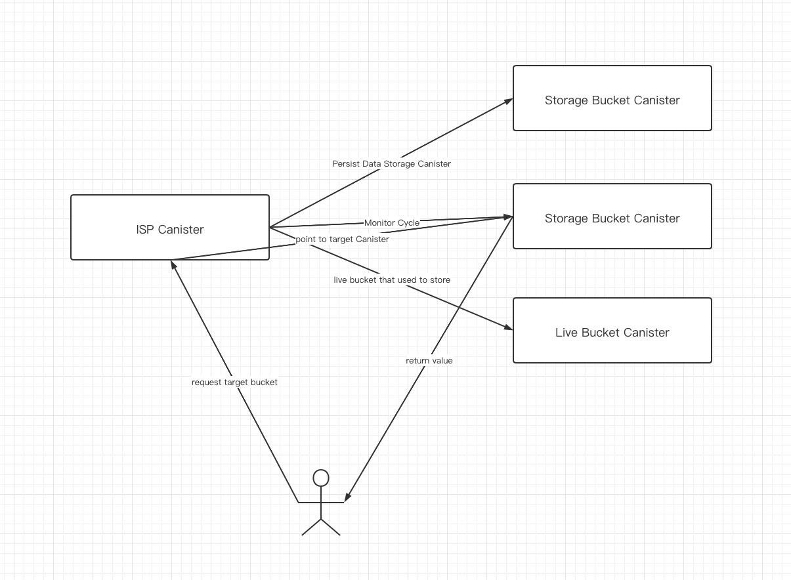

# **Internet Computer Storage Protocol**(**ICSP**)
- Autoscaling Storage
- Self Cycle Monitor
- One step store, two steps get

# Description
### Pain points for ICSP:

* Currently a Canister only has a limited amount of storage space, and when the storage space is full, the Canister needs to have the ability to automatically create new storage space. There is currently no such infrastructure to help developers do this.

* At present, the memory of Canister is divided into Stable memory and run-time memory. The use of run-time memory is related to the upgrade ability of Canister. When the run-time memory of Canister is large, the Canister can not be upgraded, this results in a reduced performance of Canister services and a failure to provide a better quality of service.

* There is currently no best practice for using both Stable memory and runtime memory, and the ISP offers a data analysis and real world test case.

### Technical features of ICSP:
1. Infinite capacity, read and write to the same Canister without having to worry about storage space.
   * Explanation: 
     * infinite capacity refers to the infinite creation of the Canister contract (in the case of a sufficient Cycle) , which supports the automatic creation of the Canister when the storage Canister is full and does not block the creation of data writes, smooth and smooth switching of storage destination.

2. Support changes.
   * Explanation: 
     * in the business, supports the data to add, delete and check four operations, and in the related operations on the memory of the appropriate optimization, to support the reuse of fragmented memory.

3. One Step Store Data and Two Steps Get Data
   * Explanation:
     * One-step storage: support back-end direct ignore ignore it ISP. Store (key, value) storage, do not have to wait for the return value, ISP comes with fault-tolerant system. It creates the convenience of storage.
     * Two-step get : first obtain from the ISP which storage unit is stored in, and then obtain metadata from that storage unit(bucket).
4. Cycle automatic monitoring
   * Explanation: 
     * ISP Heartbeat actively triggers the monitoring of ISP and storage monomer Cycle balances and automatically Top Up, so the user only needs to monitor the ISP's ICP balances.

### Advantages of ICSP:
* Data acqtion speed, IC storage base for RAM (memory) storage, from the acqtion of data efficiency, will be faster than the ROM (hard disk)-based storage base.

* Support for HTTP and Certificated Data, that is, direct access to consensus and signed Data via HTTP, or direct access to Data on nodes via HTTP (faster, status equivalent to that of a centralized server node)

* Support Programming: you can modify and delete data directly in the contract, and through the contract access restrictions, authorized access, to support more diverse forms of data distribution.

# RoadMap
- Q2 MVP Version Release : 0.01
  - Support all features  above
- Q3 Support HTTP Request and Response

# Service Interface
## ISP Canister

```motoko
    // get storage bucket from key
    get : query (key : Text) -> async Result.Result<Principal, ()>;
    // get current buckets
    getBuckets : query() -> async (LiveBucketExt, [Principal]);
    // store key & value into bucket
    store : shared(args : StoreArgs) -> async ();
```

## Bucket Canister

```motoko
    // get value from key
    get : query (key : Text) -> async Result.Result<Blob, ()>;
    // store key and value
    store : shared(args : StoreArgs) -> async ();
```

# Architecture

